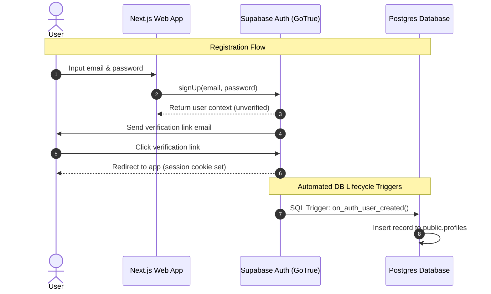
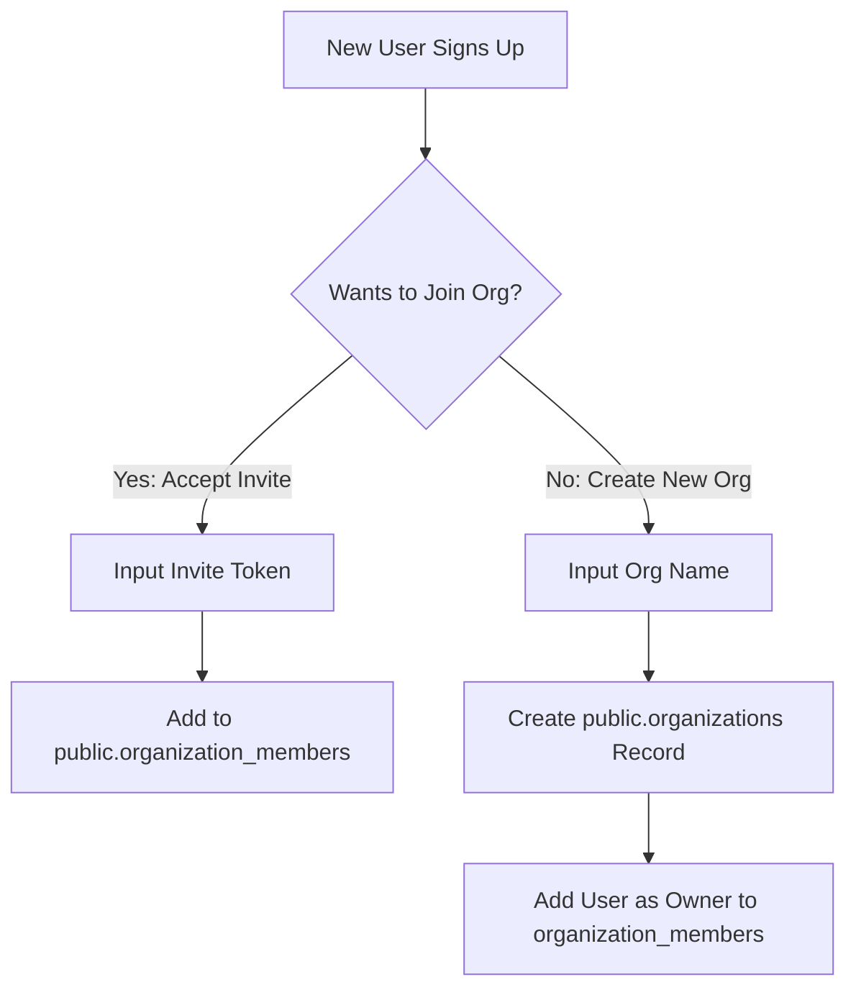

# Authentication & Profile Lifecycle Design

This document details the user registration, session management, and tenant invitation flows using Supabase Auth.

---

## 1. Authentication Flows



### 1.1. Sign Up & Profile Synchronization
Supabase Auth maintains identity credentials in an isolated `auth.users` schema. We use a Postgres trigger to automatically replicate identities to our `public.profiles` table:

```sql
-- Trigger function to synchronize profiles
create or replace function public.handle_new_user()
returns trigger as $$
begin
  insert into public.profiles (id, email, first_name, last_name)
  values (
    new.id,
    new.email,
    new.raw_user_meta_data->>'first_name',
    new.raw_user_meta_data->>'last_name'
  );
  return new;
end;
$$ language plpgsql security definer;

-- Bind trigger to auth.users
create trigger on_auth_user_created
  after insert on auth.users
  for each row execute procedure public.handle_new_user();
```

---

## 2. Organization Onboarding & Invitations



### 2.1. Invite Workflow
1. **Initiation**: An Administrator triggers an invite by entering the target user's email address.
2. **Token Generation**: The server action creates an `invitations` record with a secure UUID token and an expiration timestamp (e.g. 7 days).
3. **Email Dispatch**: An email is dispatched with the redirect url containing the token: `https://cyberguard.com/invite/accept?token=<secure-uuid>`.
4. **Acception**: When the invited user registers or logs in and lands on the redirect path, the system validates the token, marks it accepted, and inserts an entry in the `organization_members` table assigning them the pre-selected role.
