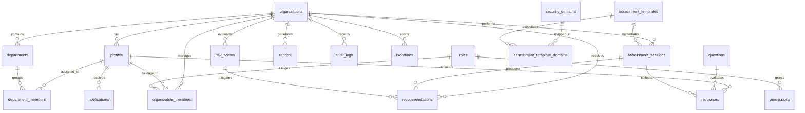

# Database Design & ER Diagram

This document details the normalized relational database schema designed for Supabase PostgreSQL.

---

## 1. Entity Relationship (ER) Diagram
The diagram below illustrates the tables, keys, and relational cardinalities:

---

## 2. Table Specifications

### 2.1. `organizations`
- **Purpose**: Represents corporate customer tenants.
- **Columns**:
  - `id` (uuid, PK): Auto-generated unique identifier.
  - `name` (text, Not Null): Organization name.
  - `created_at` (timestamptz, Not Null): Timestamp of tenant registration.
  - `updated_at` (timestamptz, Not Null).
- **Constraints**: Name cannot be empty.

### 2.2. `profiles`
- **Purpose**: Extends user profiles from Supabase Auth (`auth.users`).
- **Columns**:
  - `id` (uuid, PK, FK -> `auth.users.id`): Maps to authentication context.
  - `first_name` (text).
  - `last_name` (text).
  - `email` (text, Unique, Not Null).
  - `created_at` (timestamptz).
- **Lifecycle**: Created via PostgreSQL database trigger after a user signs up.

### 2.3. `roles`
- **Purpose**: Defines RBAC levels.
- **Columns**:
  - `id` (uuid, PK)
  - `name` (text, Unique, Not Null) - e.g., 'Owner', 'Admin', 'Security Officer', 'Manager', 'Employee'.
  - `description` (text)

### 2.4. `permissions`
- **Purpose**: Defines granular action items.
- **Columns**:
  - `id` (uuid, PK)
  - `role_id` (uuid, FK -> `roles.id`, Cascade)
  - `action` (text, Not Null) - e.g., 'assessments:write', 'users:invite', 'reports:read'.

### 2.5. `organization_members`
- **Purpose**: Maps users (profiles) to organizations with specific roles.
- **Columns**:
  - `id` (uuid, PK)
  - `organization_id` (uuid, FK -> `organizations.id`, Cascade)
  - `profile_id` (uuid, FK -> `profiles.id`, Cascade)
  - `role_id` (uuid, FK -> `roles.id`)
- **Indexes**: Unique index on `(organization_id, profile_id)`.

### 2.6. `departments`
- **Purpose**: Groups members inside an organization.
- **Columns**:
  - `id` (uuid, PK)
  - `organization_id` (uuid, FK -> `organizations.id`, Cascade)
  - `name` (text, Not Null)

### 2.7. `department_members`
- **Purpose**: Maps user profiles to departments.
- **Columns**:
  - `id` (uuid, PK)
  - `department_id` (uuid, FK -> `departments.id`, Cascade)
  - `profile_id` (uuid, FK -> `profiles.id`, Cascade)

### 2.8. `security_domains`
- **Purpose**: Categorization of controls (e.g. Identity Management, Networking).
- **Columns**:
  - `id` (uuid, PK)
  - `organization_id` (uuid, FK -> `organizations.id`, Cascade)
  - `name` (text, Not Null)
  - `description` (text, Nullable)
  - `sort_order` (integer, Not Null, Default 0)
  - `is_archived` (boolean, Not Null, Default false)

### 2.9. `assessment_templates`
- **Purpose**: Version-controlled compliance framework schemas (e.g. ISO 27001).
- **Columns**:
  - `id` (uuid, PK): Auto-generated unique identifier.
  - `organization_id` (uuid, FK -> `organizations.id`, Cascade)
  - `name` (text, Not Null): Template title.
  - `description` (text, Nullable): Template description.
  - `framework` (text, Not Null): Framework name.
  - `version` (text, Not Null): Semantic version string (e.g. 1.0.0).
  - `status` (text, Not Null): Status of template (Draft, Active, Archived).
  - `parent_template_id` (uuid, FK -> `assessment_templates.id`, Nullable): Reference to previous template.
  - `root_template_id` (uuid, FK -> `assessment_templates.id`, Nullable): Root template ancestor representing the template family.
  - `created_by` (uuid, FK -> `profiles.id`)
  - `updated_by` (uuid, FK -> `profiles.id`)
  - `archived_at` (timestamptz, Nullable)
  - `archived_by` (uuid, FK -> `profiles.id`, Nullable)
  - `created_at` (timestamptz)
  - `updated_at` (timestamptz)
  - `deleted_at` (timestamptz, Nullable)
  - `deleted_by` (uuid, FK -> `profiles.id`, Nullable)

### 2.10. `assessment_template_domains`
- **Purpose**: Many-to-many relationship mapping templates to domains.
- **Columns**:
  - `template_id` (uuid, PK, FK -> `assessment_templates.id`, Cascade)
  - `domain_id` (uuid, PK, FK -> `security_domains.id`, Cascade)
  - `sort_order` (integer, Not Null, Default 0)

### 2.11. `questions`
- **Purpose**: Audit questions linked to security domains.
- **Columns**:
  - `id` (uuid, PK)
  - `template_id` (uuid, FK -> `assessment_templates.id`, Cascade)
  - `security_domain_id` (uuid, FK -> `security_domains.id`)
  - `text` (text, Not Null)
  - `weight` (numeric, Default 1.0)

### 2.11. `assessment_sessions`
- **Purpose**: An instantiated assessment for an organization.
- **Columns**:
  - `id` (uuid, PK)
  - `organization_id` (uuid, FK -> `organizations.id`, Cascade)
  - `template_id` (uuid, FK -> `assessment_templates.id`)
  - `status` (text, Default 'DRAFT') - 'DRAFT', 'IN_PROGRESS', 'COMPLETED'
  - `completed_at` (timestamptz)

### 2.12. `responses`
- **Purpose**: Answers to questions in a session.
- **Columns**:
  - `id` (uuid, PK)
  - `session_id` (uuid, FK -> `assessment_sessions.id`, Cascade)
  - `question_id` (uuid, FK -> `questions.id`, Cascade)
  - `profile_id` (uuid, FK -> `profiles.id` - responder)
  - `value` (text, Not Null)
  - `evidence_url` (text) - Path to Supabase Storage file
  - `updated_at` (timestamptz)

### 2.13. `risk_scores`
- **Purpose**: Dynamic calculations of threats.
- **Columns**:
  - `id` (uuid, PK)
  - `organization_id` (uuid, FK -> `organizations.id`, Cascade)
  - `title` (text, Not Null)
  - `likelihood` (int, 1-5)
  - `impact` (int, 1-5)
  - `score` (int, Generated: likelihood * impact)

### 2.14. `recommendations`
- **Purpose**: Auto-generated fixes mapped to assessments and risks.
- **Columns**:
  - `id` (uuid, PK)
  - `organization_id` (uuid, FK -> `organizations.id`, Cascade)
  - `session_id` (uuid, FK -> `assessment_sessions.id`)
  - `risk_id` (uuid, FK -> `risk_scores.id`, Nullable)
  - `title` (text, Not Null)
  - `description` (text)
  - `priority` (text) - 'HIGH', 'MEDIUM', 'LOW'
  - `status` (text, Default 'OPEN')

### 2.15. `reports`
- **Purpose**: Extracted PDF/JSON compliance summary file.
- **Columns**:
  - `id` (uuid, PK)
  - `organization_id` (uuid, FK -> `organizations.id`, Cascade)
  - `title` (text, Not Null)
  - `file_path` (text, Not Null)

### 2.16. `notifications`
- **Purpose**: In-app actions for users.
- **Columns**:
  - `id` (uuid, PK)
  - `profile_id` (uuid, FK -> `profiles.id`, Cascade)
  - `title` (text, Not Null)
  - `message` (text, Not Null)
  - `read` (boolean, Default false)

### 2.17. `audit_logs`
- **Purpose**: Immutable logging.
- **Columns**:
  - `id` (uuid, PK)
  - `organization_id` (uuid, FK -> `organizations.id`, Cascade)
  - `profile_id` (uuid, FK -> `profiles.id`)
  - `action` (text, Not Null)
  - `details` (jsonb)
  - `created_at` (timestamptz, Default now())

### 2.18. `invitations`
- **Purpose**: Inviting new members.
- **Columns**:
  - `id` (uuid, PK)
  - `organization_id` (uuid, FK -> `organizations.id`, Cascade)
  - `email` (text, Not Null)
  - `role_id` (uuid, FK -> `roles.id`)
  - `token` (text, Unique, Not Null)
  - `expires_at` (timestamptz, Not Null)
