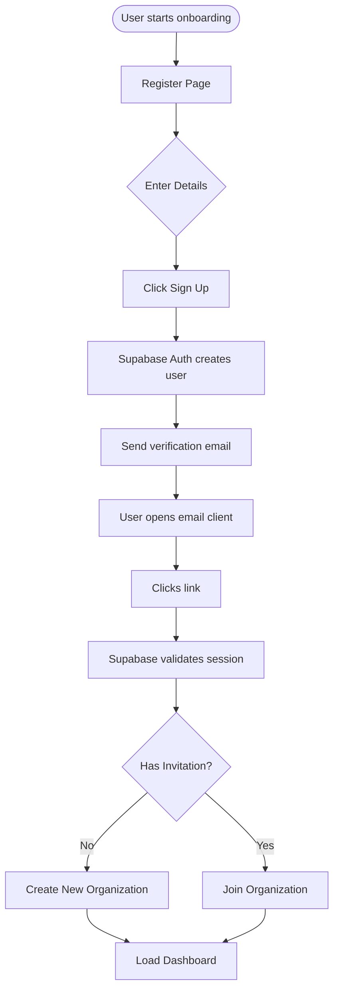
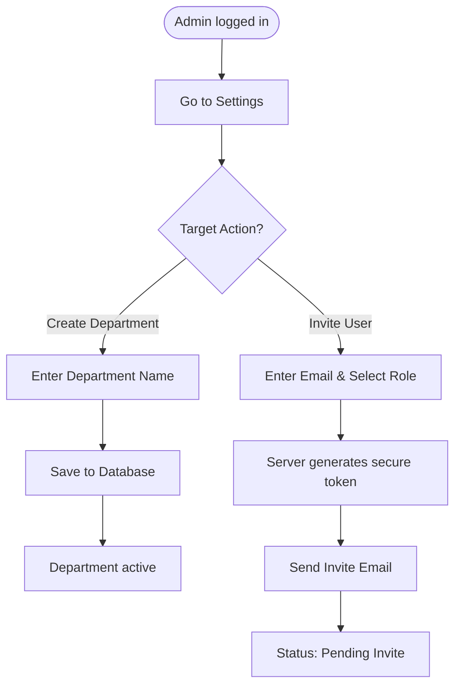
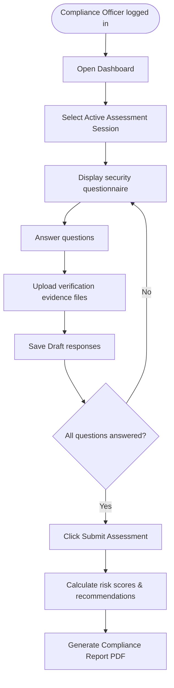

# User Flows & Interactions

This document diagrams step-by-step user interactions across key features using Mermaid flowcharts.

---

## 1. Registration, Email Verification, & Login

---

## 2. Department Creation & User Invitation

---

## 3. Assessment Completion & Reporting

